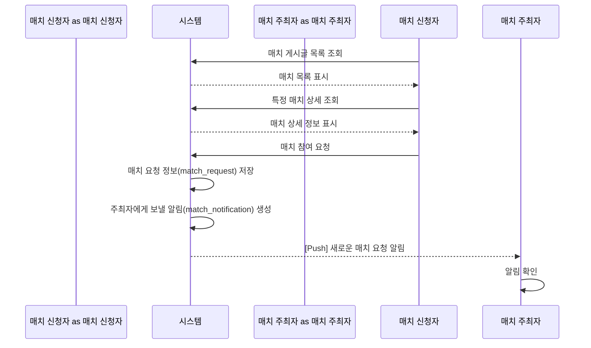
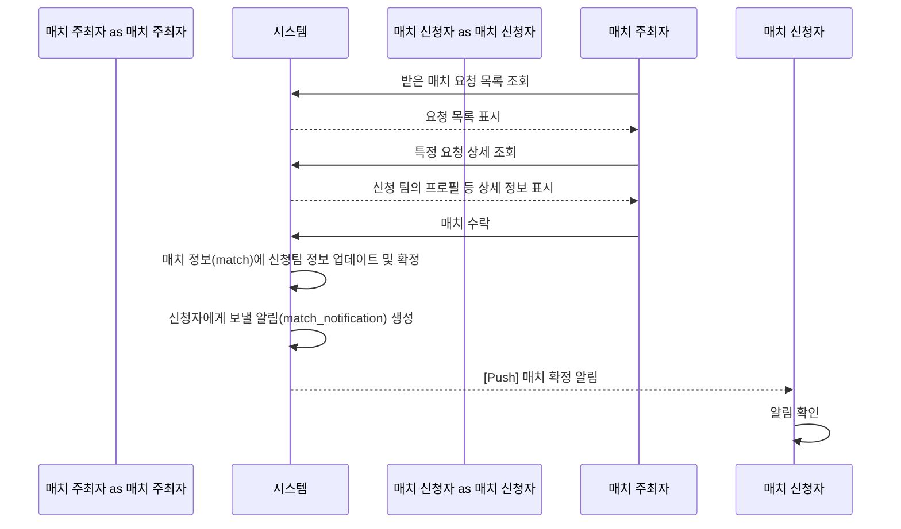
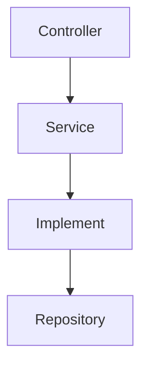
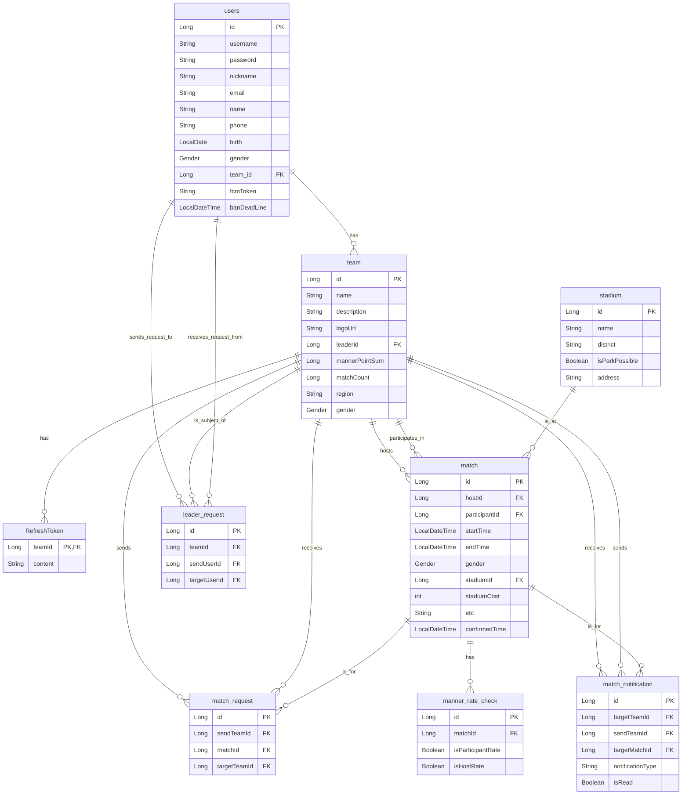
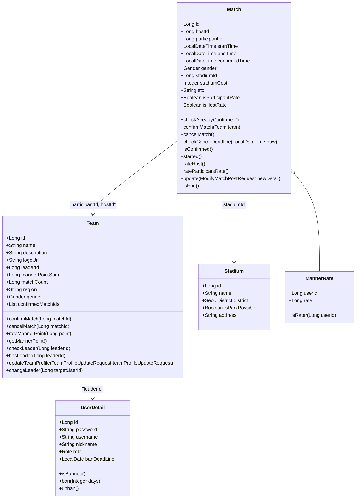

# Matching-Match-v2

## Index

### Service Description

- [1. 서비스 설명](#1-서비스-설명)
- [2. 역할 구분](#2-역할-구분)
- [3. 유저 플로우 흐름](#3-유저-플로우-흐름)

### Application Description

- [1. 어플리케이션 아키텍쳐](#1-어플리케이션-아키텍쳐쳐)
- [2. API 리스트](#2-api-리스트)
- [3. ERD](#3-erd)
- [4. 도메인 모델](#4-도메인-모델)

# Service Description

## 1. 서비스 설명

### 개요
- 아마추어 축구팀 매칭 서비스

### 목적
- 과거에 팀 프로젝트로 만든 것을 바탕으로 좋은 어플리케이션 아키텍쳐에 대한 고민을 해보기 위함.

## 2. 역할 구분

1. 매치 주최자
2. 매치 신청자

## 3. 유저 플로우 흐름

### User Story Description

[LINK](./docs/kr/user_story.md)

### User Story Diagram

#### 1. 매치 요청 흐름

1. 매치 신청자가 시스템에서 등록된 매치 목록을 봅니다.
2. 마음에 드는 매치를 선택해 상세 정보를 확인합니다.
3. 참여하고 싶으면 '매치 참여 요청'을 보냅니다.
4. 시스템은 이 요청을 저장하고, 매치 주최자에게 푸시 알림을 보내 새로운 요청이 왔음을 알립니다.

#### 2. 매치 수락 흐름

1. 매치 주최자가 본인에게 온 매치 요청 목록을 봅니다.
2. 특정 요청을 선택해 신청한 팀의 정보를 확인합니다.
3. 요청을 수락하면, 시스템은 매치를 최종 확정 상태로 변경합니다.
4. 시스템은 매치 신청자에게 매치가 확정되었다는 푸시 알림을 보내고, 양 팀의 매치 스케줄이 확정됩니다.

# Application Description

## 1. 어플리케이션 아키텍쳐쳐

### Description

기존의 전통적인 3-layer Architecture에 더해서 Implement이라는 계층을 추가.

### Rule 

1. 같은 계층의 서로 다른 클래스간의 참조는 금지됨. (Implement layer 제외)
2. 2계층을 건너 뛴 참조는 금지됨. (Service->Repository는 일부 허용)

#### Controller Layer

HTTP 요청을 수신하고, 요청에 대한 유효성 검사를 수행. 실제 비즈니스 로직을 처리하기 위해 서비스 계층(Service Layer)을 호출하고, 그 결과를 HTTP 응답으로 반환.

#### Service Layer

도메인 객체와 implement 계층의 흐름을 제어함.

#### Implement Layer 

1. 도메인 객체와 결합하여 도메인 로직과 검증을 담당함.
2. JPA Entity를 Domain 객체로 변환함.

#### Repository Layer

DB에 대한 접근을 담당.

## 2. API 리스트

### 유저 관리

| Summary | Description |
| :--- | :--- |
| 유저 정지 | 유저를 정지시킵니다. |
| 유저 정지 해제 | 유저 정지를 해제합니다. |
| 유저 목록 조회 | 유저 목록을 조회합니다. |
| 유저 탈퇴 | 유저를 탈퇴시킵니다. |
| 로그인 | 로그인을 합니다. |
| 회원가입 | 회원가입을 합니다. |

### 팀

| Summary | Description |
| :--- | :--- |
| 팀 등록 | 팀을 등록합니다. |
| 팀 삭제 | 팀을 삭제합니다. |
| 리더 변경 수락 | 리더 변경 요청을 수락합니다. |
| 리더 변경 거절 | 리더 변경 요청을 거절합니다. |
| 리더 변경 요청 | 리더 변경을 요청합니다. |
| 팀 프로필 조회 | 팀 프로필을 조회합니다. |
| 팀 프로필 수정 | 팀 프로필을 수정합니다. |

### 매치

| Summary | Description |
| :--- | :--- |
| 매치 게시글 목록 조회 | 매치 게시글 목록을 조회합니다. |
| 매치 게시글 생성 | 새로운 매치 게시글을 생성합니다. |
| 매치 게시글 조회 | 특정 매치 게시글을 조회합니다. |
| 매치 게시글 삭제 | 특정 매치 게시글을 삭제합니다. |
| 매치 게시글 수정 | 매치 게시글을 수정합니다. |
| 주최한 매치 목록 조회 | 내가 주최한 매치 목록을 조회합니다. |
| 참여한 매치 목록 조회 | 내가 참여한 매치 목록을 조회합니다. |
| 특정 팀의 주최 매치 목록 조회 | 특정 팀이 주최한 매치 목록을 조회합니다. |
| 받은 매치 요청 목록 조회 | 받은 매치 요청 목록을 조회합니다. |
| 받은 매치 요청 상세 조회 | 받은 매치 요청의 상세 정보를 조회합니다. |
| 매치 참여 요청 | 매치에 참여 요청을 보냅니다. |
| 매치 요청 수락 | 매치 요청을 수락합니다. |
| 매치 요청 취소 | 매치 요청을 취소합니다. |
| 확정된 매치 취소 | 확정된 매치를 취소합니다. |
| 매치 요청 거절 | 매치 요청을 거절합니다. |
| 매너 점수 평가 | 매너 점수를 평가합니다. |
| 푸시 알림 구독 | 푸시 알림을 구독합니다. |

## 3. ERD

### 테이블 설명

-   **users**: 사용자 정보를 저장하는 테이블
-   **team**: 팀 정보를 저장하는 테이블
-   **RefreshToken**: 로그인 유지를 위한 리프레시 토큰을 저장하는 테이블
-   **match**: 확정된 매치 정보를 저장하는 테이블
-   **match_request**: 매칭 요청 정보를 저장하는 테이블
-   **stadium**: 경기장 정보를 저장하는 테이블
-   **manner_rate_check**: 매너 점수 평가 여부를 확인하는 테이블
-   **leader_request**: 팀장 위임 요청 정보를 저장하는 테이블
-   **match_notification**: 매치 관련 알림을 저장하는 테이블

## 4. 도메인 모델

### 도메인 모델 설명

- **Match**: 매칭의 핵심 도메인 객체입니다. 매치 생성, 확정, 취소, 시간 제약 확인 등 매치와 관련된 주요 비즈니스 로직을 포함합니다.
- **Team**: 팀을 나타내는 도메인 객체입니다. 팀 정보, 리더 정보, 매너 포인트, 매치 참여 및 취소와 관련된 로직을 담당합니다.
- **Stadium**: 경기장 정보를 나타내는 간단한 데이터 객체입니다.
- **MannerRate**: 매너 점수 평가를 나타내는 값 객체(Value Object)입니다. 1점에서 5점 사이의 평가 점수를 보장하는 로직을 포함합니다.
- **UserDetail**: 사용자의 상세 정보를 나타내는 객체입니다. 사용자 제재(ban) 및 해제와 관련된 로직을 포함합니다.
