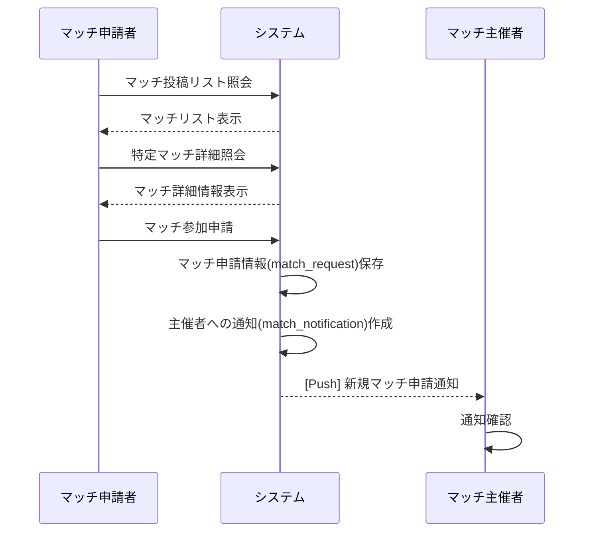
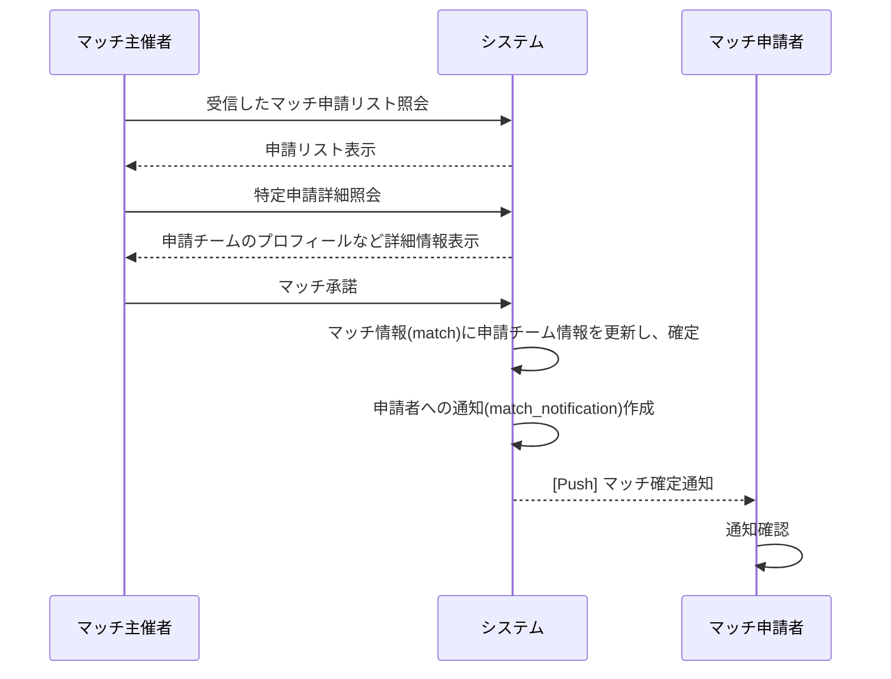
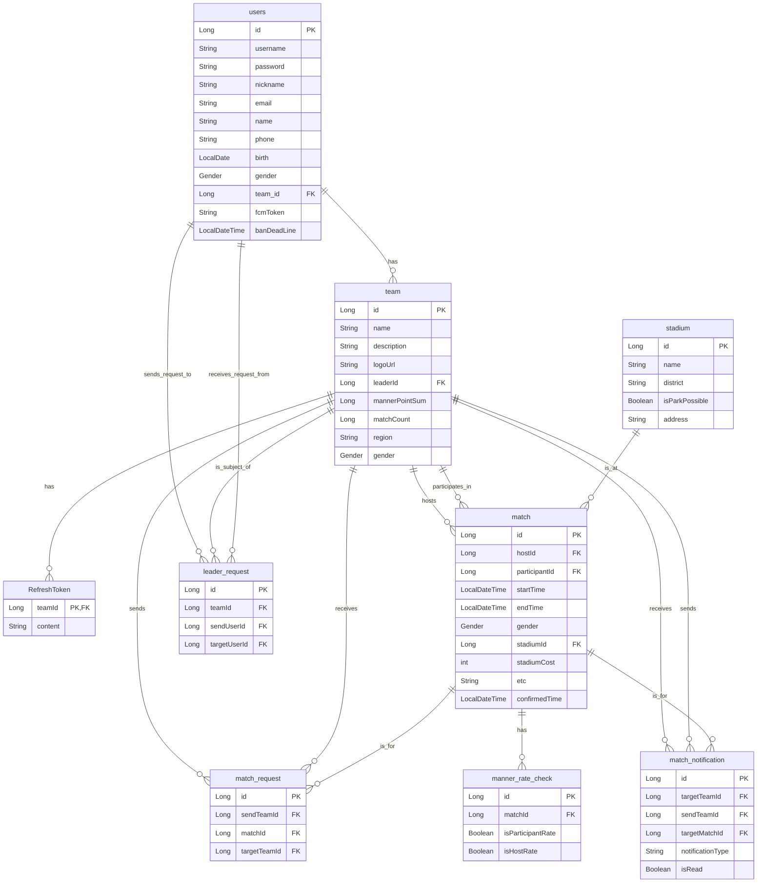

# Matching-Match-v2

## 目次

### サービス説明

- [1. サービス説明](#1-サービス説明)
- [2. 役割分担](#2-役割分担)
- [3. ユーザーフロー](#3-ユーザーフロー)

### アプリケーション説明

- [1. アプリケーションアーキテクチャ](#1-アプリケーションアーキテクチャ)
- [2. APIリスト](#2-apiリスト)
- [3. ERD](#3-erd)
- [4. ドメインモデル](#4-ドメインモデル)

# サービス説明

## 1. サービス説明

### 概要
- アマチュアサッカーチームのマッチングサービス

### 目的
- 過去にチームプロジェクトで作成したものを基に、より良いアプリケーションアーキテクチャについて考察するため。

## 2. ユーザーの区分

1. マッチ主催者
2. マッチ申請者

## 3. ユーザーフロー

### ユーザーストーリー説明

[LINK](./docs/jp/user_story.md)

### ユーザーストーリー図

#### 1. マッチ申請フロー

1. マッチ申請者がシステムに登録されたマッチリストを閲覧します。
2. 気に入ったマッチを選択し、詳細情報を確認します。
3. 参加したい場合は、「マッチ参加申請」を送信します。
4. システムはこの申請を保存し、マッチ主催者にプッシュ通知を送り、新規申請があったことを知らせます。

#### 2. マッチ承諾フロー

1. マッチ主催者が自分に届いたマッチ申請リストを閲覧します。
2. 特定の申請を選択し、申請したチームの情報を確認します。
3. 申請を承諾すると、システムはマッチを最終確定状態に変更します。
4. システムはマッチ申請者にマッチが確定したことをプッシュ通知で知らせ、両チームのマッチスケジュールが確定します。

# アプリケーション説明

## 1. アプリケーションアーキテクチャ

### Description

従来の伝統的な3層アーキテクチャに加え、Implementという層を追加しました。

### Rule 

1. 同じ層の異なるクラス間の参照は禁止されています。(Implement layerを除く)
2. 2層を飛び越えた参照は禁止されています。(Service->Repositoryは一部許容)

#### Controller Layer

HTTPリクエストを受信し、リクエストのバリデーションを実行。実際のビジネスロジックを処理するためにサービス層(Service Layer)を呼び出し、その結果をHTTPレスポンスとして返します。

#### Service Layer

ドメインオブジェクトとImplement層の流れを制御します。

#### Implement Layer 

1. ドメインオブジェクトと結合し、ドメインロジックと検証を担当します。
2. JPA EntityをDomainオブジェクトに変換します。

#### Repository Layer

DBへのアクセスを担当します。

## 2. APIリスト

### ユーザー管理

| 概要 | 説明 |
| :--- | :--- |
| ユーザー停止 | ユーザーを停止させます。 |
| ユーザー停止解除 | ユーザーの停止を解除します。 |
| ユーザーリスト照会 | ユーザーリストを照会します。 |
| ユーザー退会 | ユーザーを退会させます。 |
| ログイン | ログインします。 |
| 会員登録 | 会員登録をします。 |

### チーム

| 概要 | 説明 |
| :--- | :--- |
| チーム登録 | チームを登録します。 |
| チーム削除 | チームを削除します。 |
| リーダー変更承諾 | リーダー変更申請を承諾します。 |
| リーダー変更拒否 | リーダー変更申請を拒否します。 |
| リーダー変更申請 | リーダーの変更を申請します。 |
| チームプロフィール照会 | チームプロフィールを照会します。 |
| チームプロフィール修正 | チームプロフィールを修正します。 |

### マッチ

| 概要 | 説明 |
| :--- | :--- |
| マッチ投稿リスト照会 | マッチ投稿リストを照会します。 |
| マッチ投稿作成 | 新しいマッチ投稿を作成します。 |
| マッチ投稿照회 | 特定のマッチ投稿を照会します。 |
| マッチ投稿削除 | 特定のマッチ投稿を削除します。 |
| マッチ投稿修正 | マッチ投稿を修正します。 |
| 主催したマッチリスト照会 | 自分が主催したマッチリストを照会します。 |
| 参加したマッチリスト照会 | 自分が参加したマッチリストを照会します。 |
| 特定チームの主催マッチリスト照会 | 特定チームが主催したマッチリストを照会します。 |
| 受信したマッチ申請リスト照会 | 受信したマッチ申請リストを照会します。 |
| 受信したマッチ申請詳細照会 | 受信したマッチ申請の詳細情報を照会します。 |
| マッチ参加申請 | マッチに参加を申請します。 |
| マッチ申請承諾 | マッチ申請を承諾します。 |
| マッチ申請キャンセル | マッチ申請をキャンセルします。 |
| 確定済みマッチのキャンセル | 確定したマッチをキャンセルします。 |
| マッチ申請拒否 | マッチ申請を拒否します。 |
| マナー点数評価 | マナー点数を評価します。 |
| プッシュ通知購読 | プッシュ通知を購読します。 |

## 3. ERD

### テーブル説明

-   **users**: ユーザー情報を保存するテーブル
-   **team**: チーム情報を保存するテーブル
-   **RefreshToken**: ログイン維持のためのリフレッシュトークンを保存するテーブル
-   **match**: 確定したマッチ情報を保存するテーブル
-   **match_request**: マッチング申請情報を保存するテーブル
-   **stadium**: 競技場情報を保存するテーブル
-   **manner_rate_check**: マナー点数評価の有無を確認するテーブル
-   **leader_request**: チームリーダー委任申請情報を保存するテーブル
-   **match_notification**: マッチ関連の通知を保存するテーブル

## 4. ドメインモデル

### ドメインモデル説明

- **Match**: マッチングの核心となるドメインオブジェクトです。マッチの作成、確定、キャンセル、時間制約の確認など、マッチに関連する主要なビジネスロジックを含みます。
- **Team**: チームを表すドメインオブジェクトです。チーム情報、リーダー情報、マナーポイント、マッチ参加及びキャンセルに関連するロジックを担当します。
- **Stadium**: 競技場情報を表す単純なデータオブジェクトです。
- **MannerRate**: マナー点数評価を表す値オブジェクト(Value Object)です。1点から5点の間の評価点数を保証するロジックを含みます。
- **UserDetail**: ユーザーの詳細情報を表すオブジェクトです。ユーザー制裁(ban)及び解除に関連するロジックを含みます。
